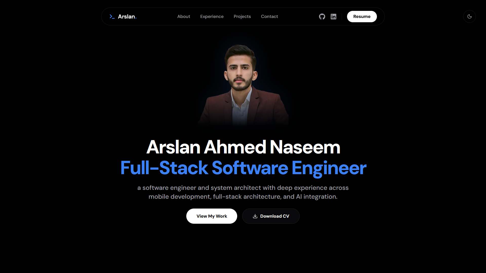

# Arslan Ahmed Portfolio

**[🌐 Live Website: arslanahmed.me](https://arslanahmed.me)**

My personal portfolio website built with Next.js, showcasing my projects, experience, skills, certifications, and technical journey as a Full-Stack Software Engineer.



## Features

- **Interactive Project Showcase:** Explore detailed case studies and browse through an organized archive of past work.
- **Smooth Animations:** Enjoy a fluid browsing experience with scroll-triggered entrance animations.
- **Dark & Light Mode:** Seamlessly switch between a sleek dark theme or a clean light theme.
- **Fully Responsive:** Experience a pixel-perfect, mobile-friendly design that adapts to any screen size or device.
- **Lightning Fast:** Navigate instantly between pages with zero layout shifts and highly optimized asset loading.
- **Accessible Design:** Built with semantic HTML and reduced-motion support to ensure a great experience for all visitors.

## Tech Stack

- **Framework:** Next.js (App Router)
- **Language:** TypeScript
- **Styling:** Tailwind CSS (v4)
- **Animations:** Framer Motion
- **Content:** MDX (next-mdx-remote, gray-matter)
- **Deployment & Analytics:** Vercel

## Architecture

The application uses the Next.js App Router with a component-driven architecture. Static portfolio data is stored in TypeScript modules, while project case studies are parsed and rendered from MDX content. Interactive client-side features are isolated to minimize the JavaScript bundle size.

## Project Structure

```text
├── content/                # MDX project case studies
├── public/                 # Static assets and media
├── src/
│   ├── app/                # Next.js App Router (pages, dynamic routes)
│   ├── components/         # Reusable UI, layout, and section components
│   ├── data/               # Static TypeScript data sets (experience, skills)
│   └── lib/                # Utility functions and MDX parsers
├── next.config.ts          # Next.js configuration
└── tailwind.config.ts      # Tailwind CSS configuration
```

## Getting Started

To run this project locally, ensure you have Node.js installed, then clone the repository and run the following commands:

```bash
# Install dependencies
npm install

# Start the development server
npm run dev

# Build for production
npm run build
```

The application will be available at [http://localhost:3000](http://localhost:3000).

## Environment Variables

The project uses the following environment variables (optional for local development):

- `NEXT_PUBLIC_GA_ID`: Google Analytics tracking ID.

## Deployment

The site is deployed on Vercel and takes advantage of Next.js App Router optimizations for fast performance and seamless deployments.

## Let's Connect

I'm always open to discussing new opportunities, collaborations, or open-source projects!

- **Portfolio:** [arslanahmed.me](https://arslanahmed.me)
- **LinkedIn:** [linkedin.com/in/mearslanahmed](https://www.linkedin.com/in/mearslanahmed/)
- **GitHub:** [@mearslanahmed](https://github.com/mearslanahmed)

